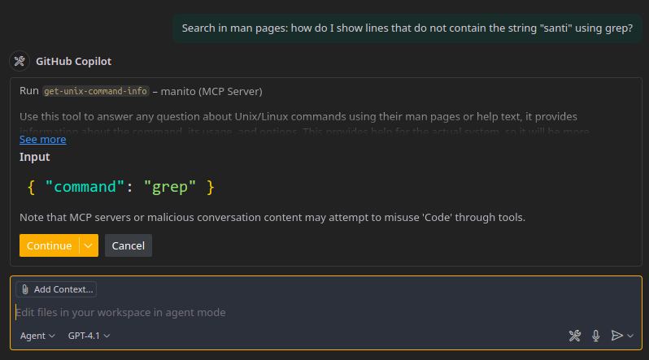
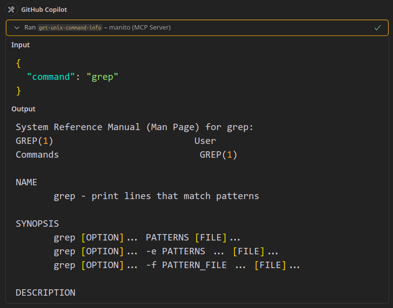
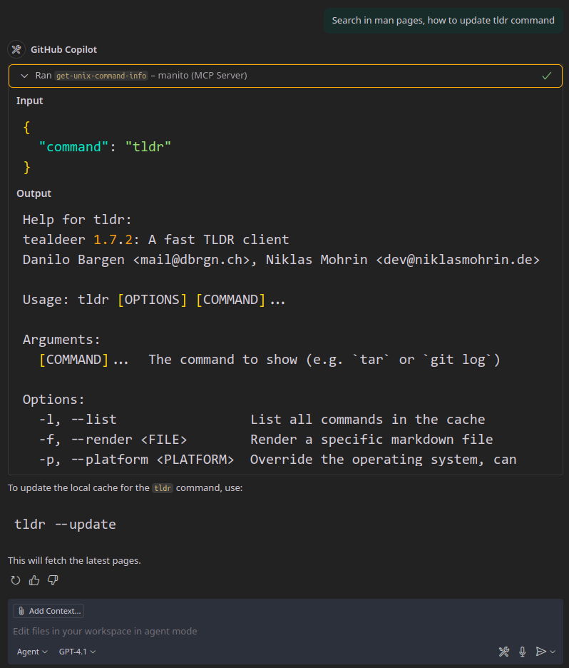
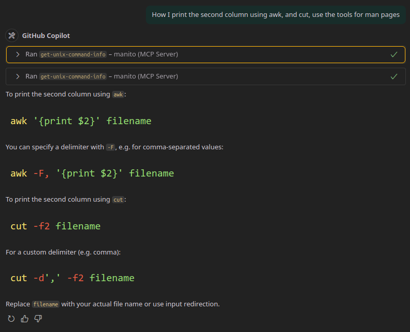

# Manito
**MCP** tool for querying and exploring Unix **Man** Pages

In case the `man` page does not exist, it falls back to the command's help output or `--help`.

## Setup

#### NPX:

```json
"manito": {
	"command": "npx",
	"args": [
		"-y",
		"tsx",
		"path_to/main.ts"
	]
}
```

#### Bun:

```json
"manito": {
	"command": "bun",
	"args": [
		"path_to/main.ts"
	]
}
```

#### Streamable HTTP:

Launch the server with:

`npx -y tsx net.ts`
or
`bun net.ts`

```json
"manito": {
	"type": "http",
	"url": "http://localhost:3000/mcp"
}
```

## Screenshots

Calling MCP:



Man Output:



Help Fallback:



Double Command:


